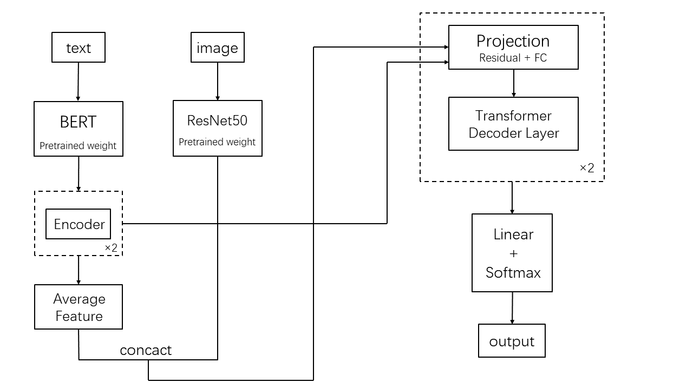

# Lab 5: Multi-Modal Sentiment Analysis

This is the repository of Modern AI course's final project in ECNU.

## Environment

Since dependencies for this project are maintained by Anaconda, it is highly recommended for you to create a new virtual environment in Anaconda for this project.

After altering to the environment, you may run the following command to install all the dependencies (remember to change to your working directory):

```powershell
pip install -r requirements.txt
```

## Repository Structure

I select some important files for detailed description.

```
.
|-- README.md
|-- __pycache__
|-- aggmodel.py  # basic model and ablation test model code
|-- clip_model.py  # CLIP model, which can be run
|-- data.py  # code of creating dataloaders
|-- dataset
|   |-- data  # original dataset
|   |-- data_split.py  # split the orginal dataset into train & val set
|   |-- test  # test set
|   |-- test_without_label.txt  # test set prediction results
|   |-- train
|   |-- train.txt
|   `-- val
|-- main.py  # the main code
|-- model.png
`-- requirements.txt
```

## Run This Code

You can reproduce the experimental results with default arguments. Also, you are allowed to run this code with your own arguments.

Specifically, you are allowed to choose your own learning rate value by putting them into command lines. Otherwise, just neglect the argument part in the following commands.

* To run the text + image model, use:

```powershell
python main.py --model agg --lr 2e-5
```

* To run the ablation test, use:

```powershell
python main.py --model text --lr 2e-5
python main.py --model image --lr 2e-5
```

* To generate the test set result, use:

```powershell
python main.py --model agg_out --lr 1e-5
```

* To run CLIP model, use:

```powershell
python clip_model.py
```

## Model Architecture

The basic architecture of this model is shown as the following picture:




## Attribution

Part of this code are based on the following repositories:

[BERT](https://huggingface.co/nlptown/bert-base-multilingual-uncased-sentiment)

[ResNet](https://pytorch.org/hub/pytorch_vision_resnet/)

[CLIP](https://huggingface.co/openai/clip-vit-base-patch32)
